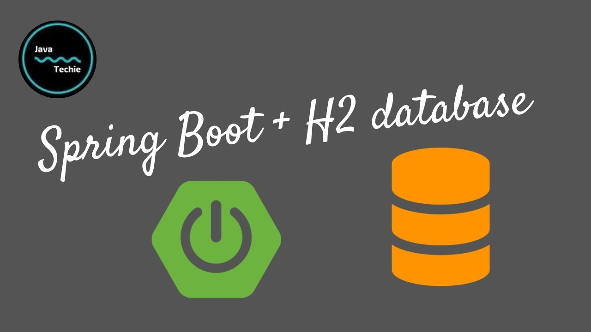
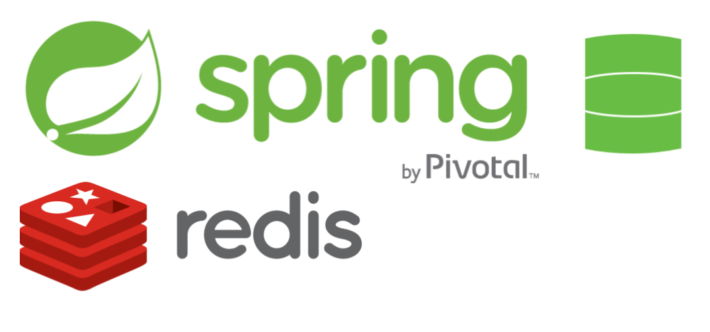
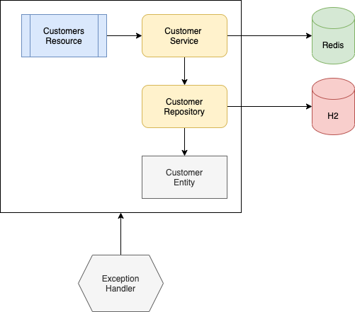
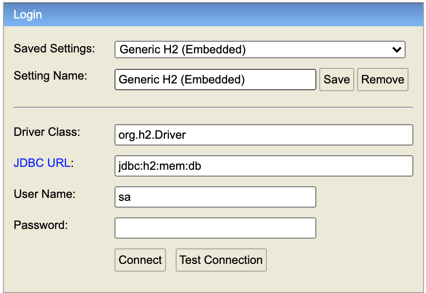

### Estrutura do projeto:
- Esse projeto contém uma API Rest que utiliza o ecossistema Spring como principal framework e para a realizar a persistência dos dados foi utilizado o banco de dados relacional em memória chamado H2, esse banco é bastante utilizado para prototipagem e testes, mas nunca para produção.

- Para realizar o cache das as informações recuperadas do repositório(banco de dados) foi utilizado o **redis**, pois possui uma boa integração com o spring boot.

### Aplicação:

1. A aplicação foi construída basicamente usando a arquitetura MVC que é de simples entendimento e se encaixa bem nesse cenário, mas se fosse uma aplicação com vários recursos, serviços, módulos e integrações seria interessante utilizar a arquitetura hexagonal ou talvez segrega-lá em varios micro-serviços.

- Na raiz do projeto dentro da pasta **postman** existe a coleção dos requests utilizados para invocar os endpoints abaixo:

- Para criar um novo cliente foi criado um recurso que expõe o endpoint **POST /customers**, que recebe como corpo os atributos: (name, email, phone, document, gender).

- Para buscar os clientes foi criado um recurso que expõe o endpoint **GET /customers**, que permite a filtragem por parâmetros na busca e podem ser usados os seguintes atributos para filtrar: (id, name, email, phone, document, gender).

- Para buscar um cliente específico por id foi criado um recurso que expõe o endpoint **GET /customers/{id}**, que permite a busca de um cliente específico por id.

- Para atualizar um cliente específico por id foi criado um recurso que expõe o endpoint **PUT /customers/{id}**, que permite alterar as informações do cliente passando os seguintes atributos no corpo da requisição: (name, email, phone, document, gender).

- Para excluir um cliente específico por id foi criado um recurso que expõe o endpoint **DELETE /customers/{id}**, quer permite excluir permanentemente o cliente por id.

2. Caso ocorra alguma exceção do tipo **ConstraintException** ou **ResourceNotFoundException** elas serão capturadas e tratadas pelo Exception Handler Advice que mapeia ambas e retorna um status http mais amigável para quem está chamando.

3. A documentação da API foi realizada utilizando o swagger v3, para acessar a documentação basta invocar o seguinte endpoint **/swagger**

### Docker
- Este projeto contém o **Dockerfile** responsável por criar a imagem e dentro dela o artefato da API para ser realizado o deploy em containers no Docker.

- Para iniciar a aplicação no docker foi criado o arquivo **docker-compose.yml** que orquestra os containers da aplicação na raiz do projeto que provê todas as depêndencias e rede para comunicação entre os containers.

### Testes:
- Foram feitos os testes unitários das regras de negócio do serviço para garantir a cobertura e corretude.

### Como iniciar a aplicação:

- Para automatizar esse processo existe um arquivo de script na raiz do repositório chamado **startup.sh** que inicia a aplicação rodando os seguintes comandos no terminal:

`./gradlew clean build`
- Apaga o diretório _**build**_ e constrói o artefato chamado globo-subscriptions-0.0.1-SNAPSHOT.jar no diretório _**build/libs**_ novamente.

`docker-compose up -d`
- Esse comando utiliza o docker compose que lê o arquivo _**docker-compose.yml**_ para criar os containers do **Redis** e da **API**, necessários para serem realizadas as chamadas na API e a conexão com o Redis.

- Após isso a aplicação estará disponível na porta **_8080_**.

- Para acessar o banco de dados em memória **H2** existe um console disponibilizado pelo mesmo que pode ser acessado através do endpoint **_/h2_**. Para se autenticar no H2 basta alterar o campo JDBC URL para os valor apresentado na imagem abaixo:

### Como encerrar a aplicação

- Para encerrar os containers criados pelo docker compose, execute o arquivo de script **`shutdown.sh`** na raiz do repositório.

### Observações

- Pelo entendimento que eu tive sobre cada elemento da api de clientes retornar a idade eu criei um campo chamado **createdAt**, que ao salvarmos o cliente ele é setado com a data e hora atual da gravação e também foi criado o campo **version** que controla a versão do registro na base de dados garantindo que em casos concorrências e locks não haja uma perda de informação.  